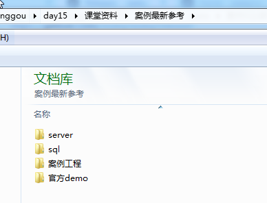
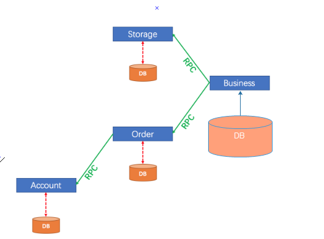
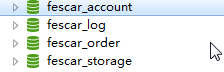
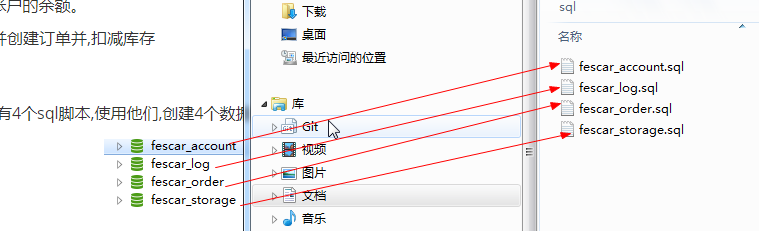
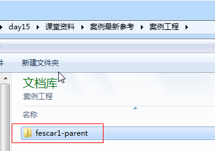
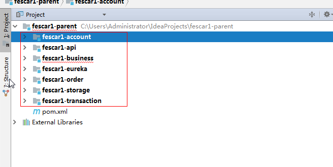

# fescar案例

Base理论

​	BASE：全称：Basically Available(基本可用)，Soft state（软状态）,和 Eventually consistent（最终一致性）三个短语的缩写，来自 ebay 的架构师提出.

​	既是无法做到强一致性（Strong consistency），但每个应用都可以根据自身的业务特点，采用适当的方式来使系统达到最终一致性（Eventual consistency）。

## 说明

参考案例如下:

## 需求分析,如下图:

- 存储服务：扣除指定商品的库存。
- 订单服务：根据购买请求创建订单,同时扣减余额。
- 帐户服务：扣减用户帐户的余额。
- 业务服务 : 创建日志,并创建订单并,扣减库存

准备sql: 如上图sql目录下有4个sql脚本,使用他们,创建4个数据库,如下:

可以执行如下图所示的脚本:

## 导入工程:

导入如下工程,用于创建springcloud微服务,并实现分布式事务.

测试:

​	启动各个微服务:

其中:fescar1-transaction 为抽取出公共的需要分布式事务的工程.

其他的为微服务.

## 创建微服务说明

1.创建一个eureka-server

2.创建存储微服务

​	+ mysql + jdbctemplate + druiddatasource+ feign+starter-web+eurek-client

3.创建订单微服务

+ mysql + jdbctemplate + druiddatasource+ feign+starter-web+eurek-client

4.创建账户微服务

+ mysql + jdbctemplate + druiddatasource+ feign+starter-web+eurek-client

5.创建业务微服务

+ mysql + jdbctemplate + druiddatasource+ feign+starter-web+eurek-client

每一个微服务 都需要被fescar管理起来,统一独里成功 一个工程,每一个微服务依赖独立工程就可以了.

fescar1-transaction:

 + 创建XID(注解修饰某一个方法,方法就是全局事务的入口)
 + 绑定线程
 + 传播全局事务的xID
 + 创建fescar的数据源代理

+ 每一个微服务需要注册到注册中(TC)
+ 创建一个注册中(TC)

